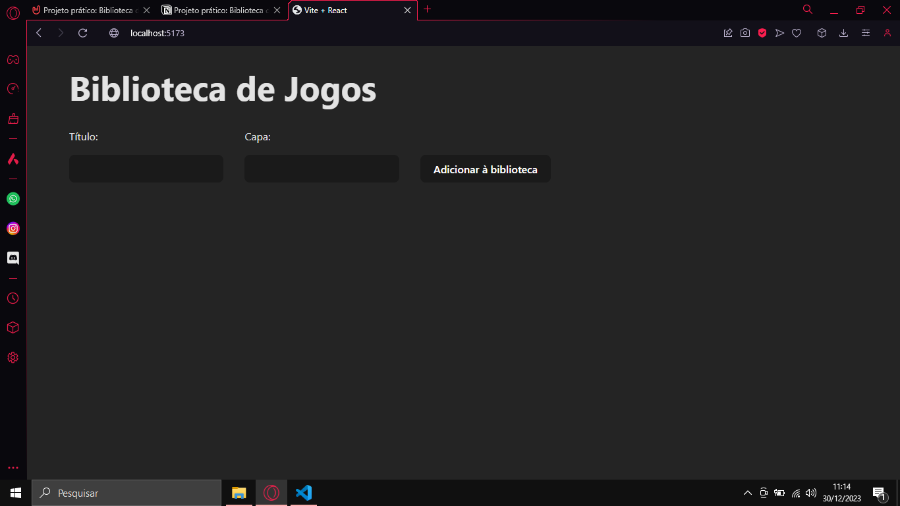
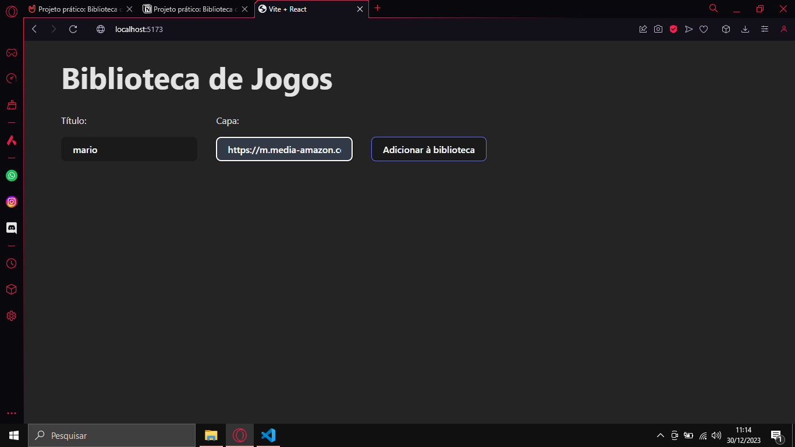
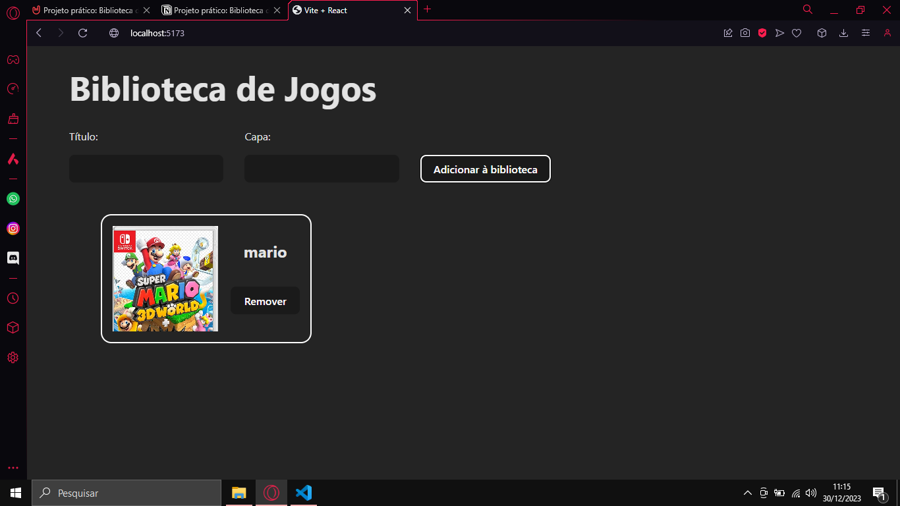
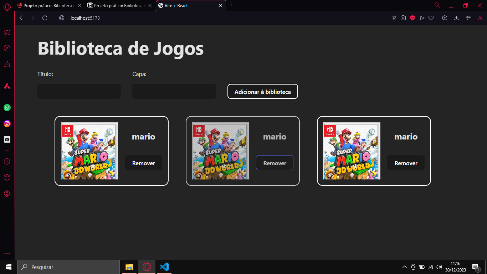
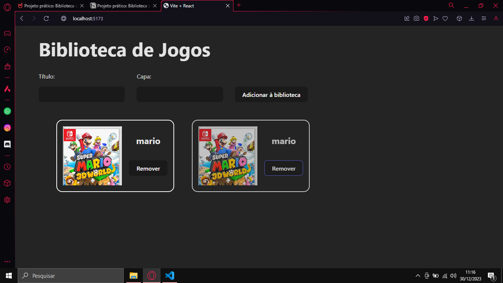

# Biblioteca de jogos - React

Uma aplicação em React.js para gerenciar uma coleção de jogos que persiste os dados no local storage, evitando que eles se percam ao sair da página.

Tela Inicial

Inputando Titulo, url da Imagem

Adicionando o Jogo

Deletanto o Jogo

